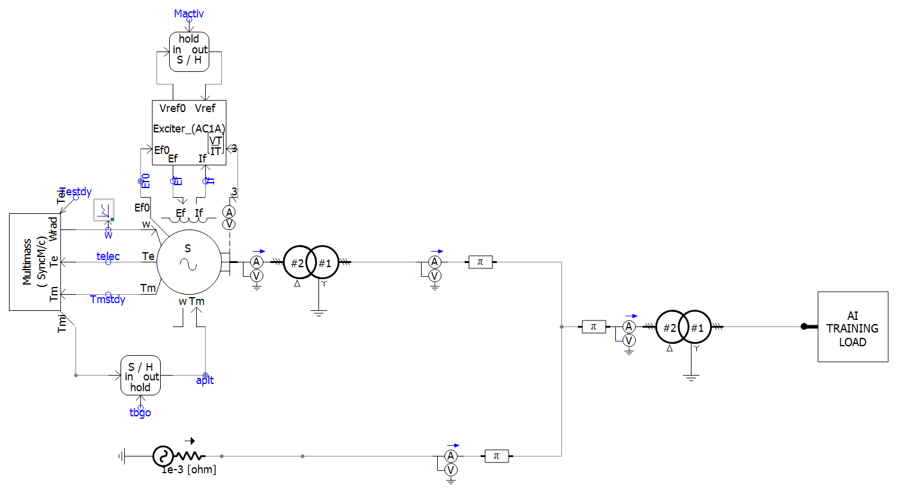

# Data_Center_Hydro_Risk_Assessment

EMT models in PSCAD for studying hydro-generator shaft fatigue risk arising from persistent sub-synchronous active-power oscillations induced by large AI data center loads.

## Folder Contents

| File | Type | Purpose |
|---|---|---|
| `DML_Components` | PSCAD component library | Shared library of custom models (data center load models, hydro-generator/turbine-governor models, measurement/control blocks, etc.) referenced by both case files below. Must be added as a library project before compiling/running the other two files. |
| `hydro_grid_AI_load_freq.pscx` | PSCAD case | Simulates dynamic response of a multi-mass hydro-generator connected to an AI data center load |
| `hydro_grid_AI_load_TF.pscx` | PSCAD case | Simulates the time-series data for evaluating the transfer function of a multi-mass hydro-generator model |

## Case File Details

### `hydro_grid_AI_load_freq.pscx` — Time-Domain Simulation

Run this file to simulate the dynamic response of a multi-mass hydro-generator connected to an AI data center load.

<ol type="a">
<li>The AI training load is modeled to represent a bi-periodic square-wave workload profile. Users can configure the base load, amplitude of load fluctuation, and frequencies and duty cycle of the bi-periodic square wave.
<figure>
  
  <figcaption>Fig. 1: Overview of the hydro-generator and AI data center EMT model.</figcaption>
</figure></li>
<li>The electrical parameters of the generator to be configured in the synchronous machine model. The defaults are configured for a salient pole machine with parameters from [1].</li>
<li>The machine speed, generator and turbine inertias, shaft stiffness and damping can be configured in the multi-mass component of the machine model. Example parameter values for three generator units Unit A, GC-7, GC-19, are listed in Table 1.</li>
</ol>

**Table 1: PSCAD multi-mass torsional shaft model parameters**

| Design Parameter | Units | Unit A | GC-7 | GC-19 |
|---|---|---|---|---|
| Generator rating | – | 500 MVA | 60 MVA | 715 MVA |
| Rated speed | – | 150 rpm | 200 rpm | 72 rpm |
| Turbine inertia | kg·m² | 1.68 × 10⁶ | 90.6 × 10³ | 8428 × 10³ |
| Generator inertia | kg·m² | 33.75 × 10⁶ | 0.653 × 10⁶ | 107 × 10⁶ |
| Shaft spring constant | Nm/rad | 18.66 × 10⁹ | 0.208 × 10⁹ | 12.09 × 10⁹ |
| Turbine damping | Nm·s/rad | 5.01 × 10⁶ | 1.37 × 10⁵ | 12.6 × 10⁶ |

---

### `hydro_grid_AI_load_TF.pscx` — Frequency-Domain (Transfer Function) Analysis

Run this file to simulate the time-series data for evaluating the transfer function of a multi-mass hydro-generator model.

<ol type="a">
<li>Variable f_osc to be varied over the desired frequency range. The model currently does not support automation over the entire frequency range. So frequencies need to be simulated one at a time, responses recorded and saved, and then the next set of simulations are to be run.</li>
</ol>